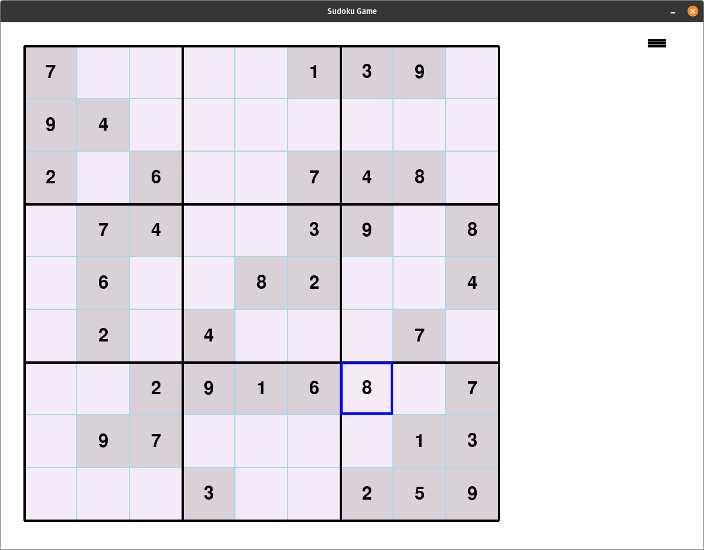
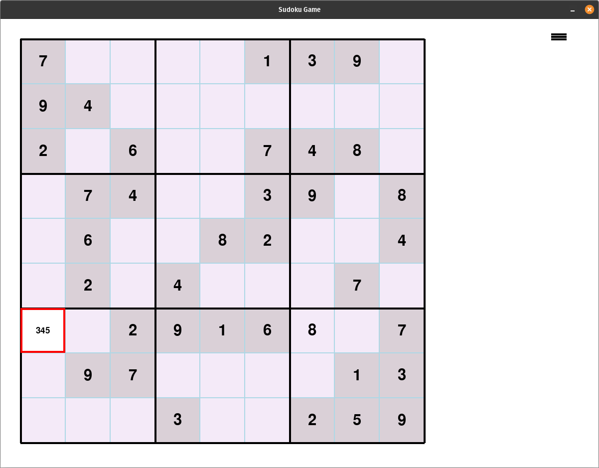
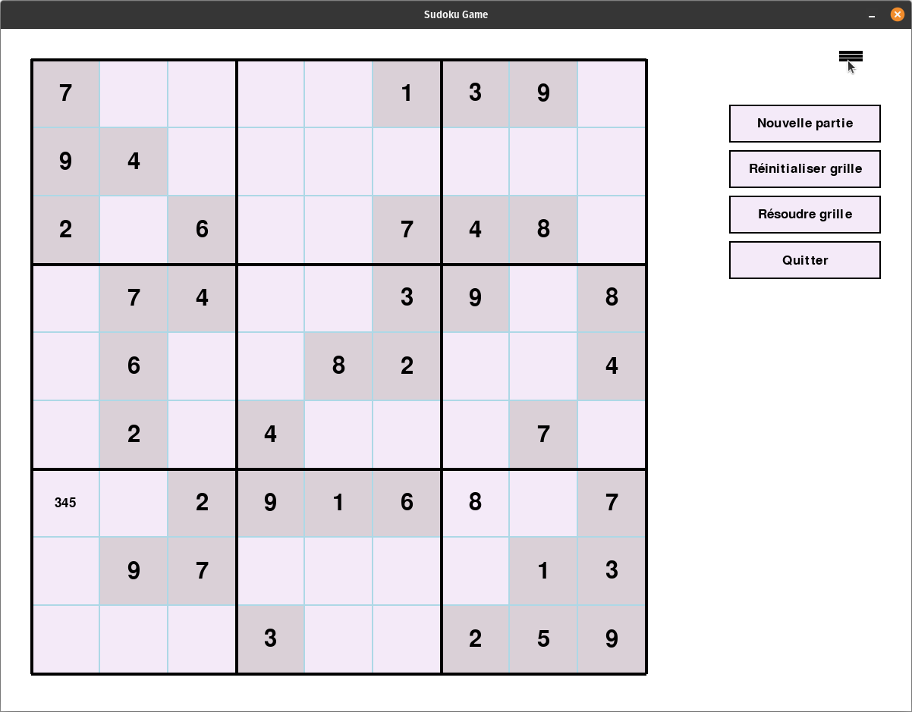

# sudoku

This is a Sudoku game implemented using the Pygame library. It allows the user to play Sudoku by clicking on the cells and inputting numbers. 

To enter a value: select the cell with a left click.
To enter a list of candidate: select the cell with a right click.

After selecting a cell, use Backspace or delete to remove a value or a candidate.

To open/close the menu click on the hamburger button on the top right side of the window.

example:

Left click: select the cell; the border turn blue; enter a value.

Right click: select the cell; the border turn red; enter a list of candidate.

Open/close menu: click on the hambergur button on the top right corner.

Here is a breakdown of the code:

1. The code begins by importing the necessary modules: `pygame`, `random`, and `sudoku_generator`.

2. The `SudokuGame` class is defined. It serves as the main game class and contains methods for initializing the game, handling events, drawing the grid and menu, and managing the game logic.

3. The `__init__` method initializes the game by setting up the Pygame window, defining colors, fonts, and sizes, and creating the initial grid and menu.

4. The `create_menu` method is used to define the menu button and options.

5. The `create_menu_options` method is called to create the rectangles for the menu options based on their positions and sizes.

6. The `draw_menu_button` method is responsible for drawing the menu button on the screen.

7. The `draw_menu_options` method is responsible for drawing the menu options on the screen.

8. The `handle_menu_click` method is used to handle clicks on the menu button or menu options.

9. The `draw_window` method is responsible for drawing the grid, menu button, and menu options on the screen.

10. The `create_widgets` method is used to create the cells of the Sudoku grid as rectangles with their respective values and properties.

11. The `draw_grid` method is responsible for drawing the Sudoku grid on the screen, including the cells, borders, and numbers.

12. The `select_cell` method is used to select a cell by highlighting it with a blue rectangle.

13. The `update_candidate` method allows the user to input candidates for a selected cell.

14. The `start_new_game` method generates a new Sudoku grid and solution and creates new widgets for the game.

15. The `reinitialize_grid` method resets the editable cells in the grid to their initial state.

16. The `solve_grid` method solves the Sudoku grid and updates the grid accordingly.

17. The `handle_events` method handles various events such as mouse clicks, key presses, and mouse motion.

18. The `grid_completed` method checks if the grid has been completed by comparing it with the solution.

19. The `play_game` method is the main game loop that continuously handles events and updates the screen.

20. The `run` method is called to start the game.

21. Finally, the code generates a Sudoku grid and solution using the `generate_sudoku` function from the `sudoku_generator` module, creates an instance of the `SudokuGame` class, and runs the game.

Note: The code assumes that the `sudoku_generator` module is available and contains the necessary functions for generating Sudoku grids and solutions. Make sure you have the `sudoku_generator.py` file in the same directory as your main script, or provide the correct path to the module.

